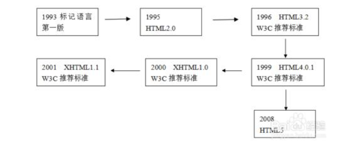

# 1、初始html5

### 1.1、HTML5新标签与特性

**兼容性 ie9以上**



### 1.2、字符设定

- <meta http-equiv="charset" content="utf-8">：HTML与XHTML中建议这样去写
- <meta charset="utf-8">：HTML5的标签中建议这样去写

### 1.3、结束标签的规范

​       不写结束标签不会报错，body也可以省略，但是不推荐

```html
<!DOCTYPE html>
<html>
	<head>
		<meta charset="utf-8" />
		<title></title>
	</head>
	<body>
		<div>div1
		<div>div2
		<div>div3
		<div>div4
		<div>div5
		<div>div6
		<div>div7
		<div>div8
		<div>div9
		<div>div10
	
</html>
```


### 1.4、语义化标签的由来


# 2、常用新标签

HTML5的语义化标签以及属性，可以让开发者非常方便地实现清晰的web页面布局 

### 2.1、结构划分

- **header** 页眉 主要用于页面的头部的信息介绍，也可用于板块头部

- **footer**页脚  页面的底部 或者 版块底部

- **nav**导航 （包含链接的的一个列表）

- **article**：定义页面独立的内容区域,,article适用于独立性强的内容，如本身就是一篇文章、博客，或者用户的评论等 

- **section**：定义文档的节（section、区段），每个 <section> 一般都有一个主题思想，但未必一定要有 <h> 元素。

- **aside**：定义突出的引用、广告、侧边栏。

  ```html
  <header> 语义 :定义页面的头部  页眉</header>
  <nav>  语义 :定义导航栏 </nav> 
  <footer> 语义: 定义 页面底部 页脚</footer>
  <article> 语义:  定义文章</article>
  <section> 语义： 定义区域</section>
  <aside> 语义： 定义其所处内容之外的内容 侧边</aside>
  ```

  

   [更多标签](http://www.w3school.com.cn/html5/html5_reference.asp)

### 2.2、语义化标签

- **datalist**:<datalist> 标签定义选项列表。请与 input 元素配合使用该元素，来定义 input 可能的值。datalist 及其选项不会被显示出来，它仅仅是合法的输入值列表。请使用 input 元素的 list 属性来绑定 datalist。

```html
<input list="cars" />
<datalist id="cars">
	<option value="BMW">
	<option value="Ford">
	<option value="Volvo">
</datalist>
```

- **time**:time标签对于布局是没有任何影响的，我们直接用一个span也一样可以实现。这个标签主要的主要原因就是在蜘蛛爬取的时候可以爬取到，知道这是时间，进而可以得到相关的流量。

```html
月份显示：
<time datetime="2014-3-21">2014年3月21日</time>

具体时间显示（采用24小时制）：
<time datetime="16:30">下午4点半</time>

结合显示（中间隔一个空格）：
<time datetime="2018-3-21 16:30">2018-3-21 16:30</time>

```

- **mark**: 使用mark标签元素，可以高亮显示文档中的文字以达到醒目的效果。 

```html
<!DOCTYPE html>
  <html>
  <head>
 <meta charset=utf-8>
 	<title>使用Mark元素高亮显示文本</title>
      <style>
          mark {
              background-color:#00ff90; font-weight:bold;
          }
      </style>
 
 </head>
 <body>
 
     <article>
         <header>
             <h1>百科</h1>
         </header>
         <p>百度百科是一部内容开放、自由的网络<mark>百科</mark>全书,旨在创造一个涵盖所有领域知识,服务所有互联网用户的中文知识性<mark>百科</mark>全书。在这里你可以参与词条编辑,分享贡献你的知识</p>
     </article>
 </body>
 </html>
```

- **progress**  :表示定义一个进度条，用途很广泛，可以用在文件上传的进度显示，文件下载的进度显示，也可以作为一种loading的加载状态条使用。 

```html
<progress value='70' max='100'></progress>
```


### 2.3、新增的input type属性值：

<!-- 注释：Internet Explorer、Firefox 或者 Chrome 不支持 <input type="datetime"> 元素，Safari 中部分支持。Opera 12 以及更早的版本中完全支持。 -->

| **类型******     | **使用示例******        | **含义******         |
| ---------------- | ----------------------- | -------------------- |
| **email******    | <input type="email">    | 输入邮箱格式         |
| **tel******      | <input type="tel">      | 输入手机号码格式     |
| **url******      | <input type="url">      | 输入url格式          |
| **number******   | <input type="number">   | 输入数字格式         |
| **search******   | <input type="search">   | 搜索框（体现语义化） |
| **range******    | <input type="range">    | 自由拖动滑块         |
| **time******     | <input type="time">     | 小时分钟             |
| **date******     | <input type="date">     | 年月日               |
| **datetime****** | <input type="datetime"> | 时间                 |
| **month******    | <input type="month">    | 月年                 |
| **week******     | <input type="week">     | 星期 年              |

兼容性http://www.w3school.com.cn/html5/html_5_form_input_types.asp


### 2.4、常用新属性

autocomplete: input历史记录的功能,on是打开,off是关闭. 默认为on. 说白了就是是否让浏览器自动记录之前输入的值. 

http://www.w3school.com.cn/tiy/t.asp?f=html5_input_autocomplete

| **属性******         | **用法******                                   | **含义******                                                 |
| -------------------- | ---------------------------------------------- | ------------------------------------------------------------ |
| **placeholder******  | <input type="text" placeholder="请输入用户名"> | 占位符  当用户输入的时候 里面的文字消失  删除所有文字，自动返回 |
| **autofocus******    | <input type="text" autofocus>                  | 规定当页面加载时 input 元素应该自动获得焦点                  |
| **multiple******     | <input type="file" multiple>                   | 多文件上传                                                   |
| **autocomplete****** | <input type="text" autocomplete="off">         | 规定表单是否应该启用自动完成功能  有2个值，一个是on 一个是off      on 代表记录已经输入的值  1.autocomplete 首先需要提交按钮 <br/>2.这个表单您必须给他名字 |
| **required******     | <input type="text" required>                   | 必填项  内容不能为空                                         |


### 2.5、多媒体标签

- audio：播放音频
- video：播放视频

#### 2.5.1、多媒体 video

HTML5通过<audio>标签来解决音频播放的问题。

同音频播放一样，<video>使用也相当简单，如下图

 

同样，通过附加属性可以更友好的控制视频的播放

autoplay 自动播放

controls 是否显示默认播放控件

loop 循环播放

width 设置播放窗口宽度

height 设置播放窗口的高度

由于版权等原因，不同的浏览器可支持播放的格式是不一样的，如下图供参考

 

**多浏览器支持的方案，如下图******


#### 2.5.2、多媒体 audio

HTML5通过<audio>标签来解决音频播放的问题。

使用相当简单，如下图所示

 

并且可以通过附加属性可以更友好控制音频的播放，如：

autoplay 自动播放

controls 是否显不默认播放控件

loop 循环播放    如果这个属性不写 默认播放一次        loop  或者  loop = “loop”    表示无限循环

由于版权等原因，不同的浏览器可支持播放的格式是不一样的，如下图供参考

 

多浏览器支持的方案，如下图

<source> 标签允许您规定可替换的视频/音频文件供浏览器根据它对媒体类型或者编解码器的支持进行选择

 


#### 